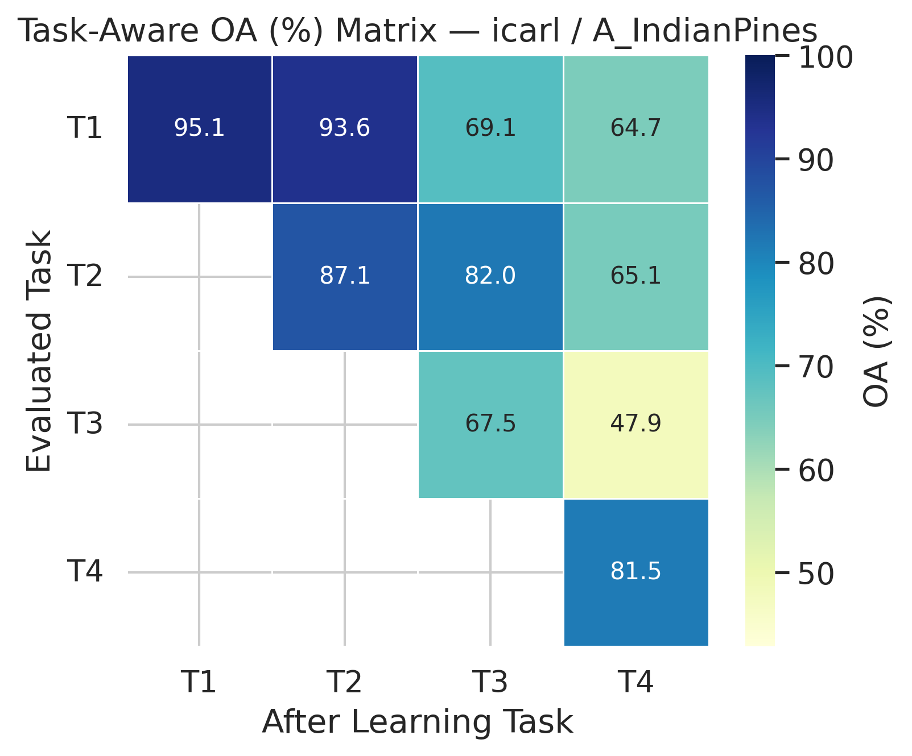
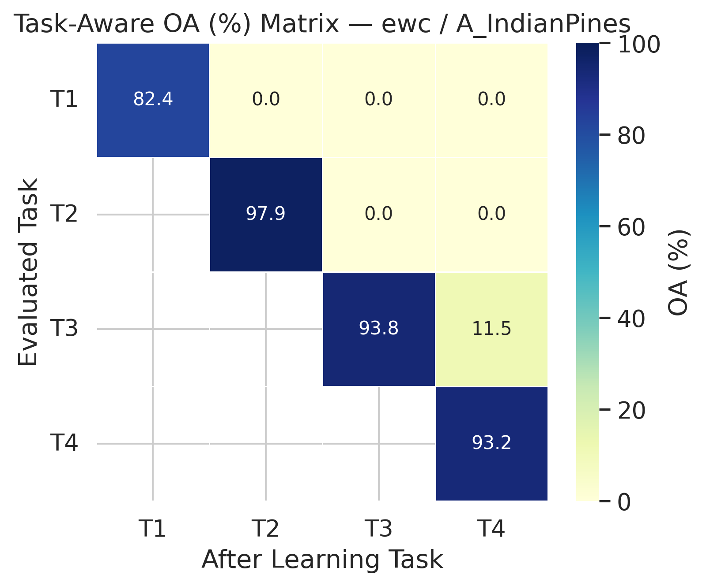
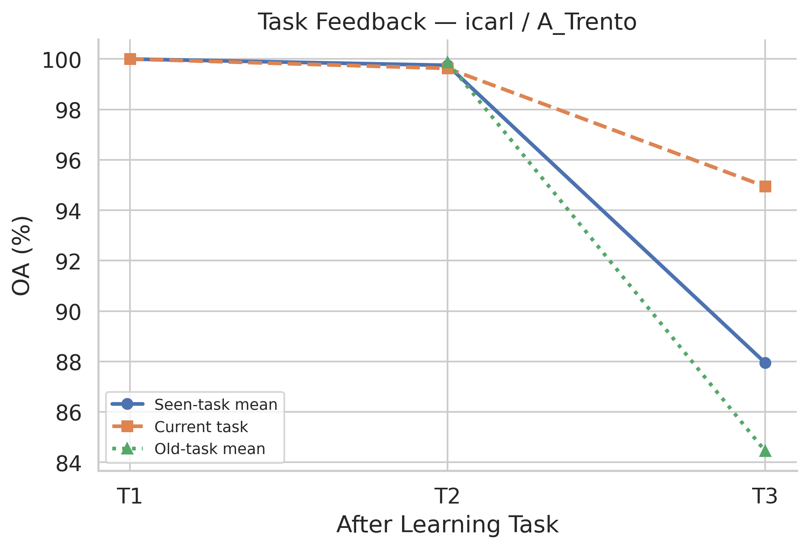
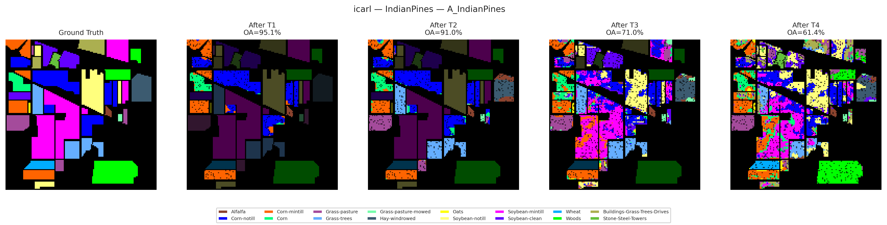
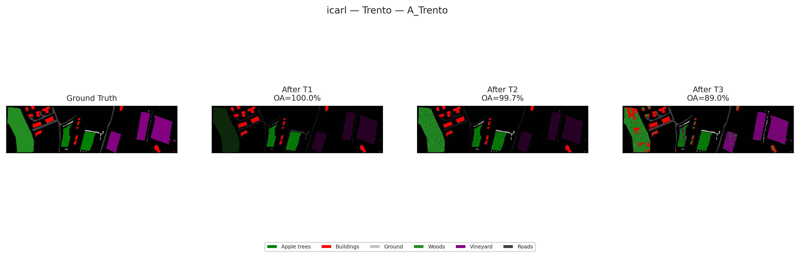

<p align="center">
  <h1 align="center">RS-CIL-Suite</h1>
  <p align="center">
    A Standardized Class-Incremental Learning Suite<br>for Remote Sensing Hyperspectral Imagery
  </p>
</p>

<p align="center">
  <a href="./README_CN.md">中文</a> &bull;
  <a href="#quick-start">Quick Start</a> &bull;
  <a href="#datasets">Datasets</a> &bull;
  <a href="#methods">Methods</a> &bull;
  <a href="#protocols">Protocols</a> &bull;
  <a href="#backbones">Backbones</a> &bull;
  <a href="#visualization">Visualization</a> &bull;
  <a href="#adding-a-new-method">Extend</a>
</p>

<p align="center">
  
  
  
  
  
  
</p>

---

## Key Features

- **10 public HSI datasets** with automatic download and preprocessing (PCA, normalization, patch extraction)
- **17 CIL methods** spanning regularization, replay, distillation, analytic, and gradient-projection families
- **5 backbone architectures** — from lightweight CNN (0.1M) to ViT-Small (10.7M)
- **15 built-in evaluation protocols** (within-scene + cross-scene) and custom YAML protocol support
- **8 exemplar selection strategies** (herding, k-center, entropy, k-means, etc.)
- **Task-aware evaluation** with exact spatial coordinates for classification map visualization
- **Publication-quality figures** — task accuracy matrices, feedback curves, HyperKD-style map grids
- **YAML config system** with CLI overrides, wandb integration, and self-describing checkpoints
- **66 unit tests** with GitHub Actions CI

---

## Quick Start

```bash
# Install
pip install -r requirements.txt

# Download a dataset
python benchmark/download.py --dataset IndianPines --root ~/datasets/rs_cil

# Run an experiment
python benchmark/run.py \
    --protocol A_IndianPines \
    --method icarl \
    --data_root ~/datasets/rs_cil \
    --seed 0 \
    --output results/icarl_A_IP.json \
    --plot

# Compare methods
python benchmark/compare.py results/ --latex
```

---

## Datasets

All 10 datasets download automatically via `download.py` (no registration required).

| Dataset | Modality | Classes | HSI Size | Aux Size |
|---------|----------|:-------:|----------|----------|
| [Trento](https://github.com/tyust-dayu/Trento) | HSI + LiDAR | 6 | 166 x 600 x 63 | 166 x 600 x 1 |
| [Houston 2013](https://github.com/songyz2019/rs-fusion-datasets-dist) | HSI + LiDAR | 15 | 349 x 1905 x 144 | 349 x 1905 x 1 |
| [MUUFL](https://github.com/GatorSense/MUUFLGulfport) | HSI + LiDAR | 11 | 325 x 220 x 64 | 325 x 220 x 2 |
| [Augsburg](https://github.com/songyz2019/rs-fusion-datasets-dist) | HSI + SAR | 8 | 332 x 485 x 180 | 332 x 485 x 4 |
| [Houston 2018](https://github.com/songyz2019/rs-fusion-datasets-dist) | HSI + LiDAR | 20 | 1202 x 4768 x 50 | 1202 x 4768 x 1 |
| [Indian Pines](https://www.ehu.eus/ccwintco/index.php/Hyperspectral_Remote_Sensing_Scenes) | HSI | 16 | 145 x 145 x 200 | -- |
| [Pavia University](https://www.ehu.eus/ccwintco/index.php/Hyperspectral_Remote_Sensing_Scenes) | HSI | 9 | 610 x 340 x 103 | -- |
| [Salinas](https://www.ehu.eus/ccwintco/index.php/Hyperspectral_Remote_Sensing_Scenes) | HSI | 16 | 512 x 217 x 204 | -- |
| [Berlin](https://github.com/songyz2019/rs-fusion-datasets-dist) | HSI + SAR | 8 | 476 x 1723 x 244 | 476 x 1723 x 4 |
| [WHU-Hi-LongKou](https://huggingface.co/datasets/danaroth/whu_hi) | UAV HSI | 9 | 550 x 400 x 270 | -- |

Each dataset is preprocessed once and cached:
`raw .mat` &rarr; PCA (default 36 bands, fitted on train pixels only) &rarr; normalize (train-pixel stats) &rarr; mirror pad &rarr; patch extraction (default 7x7) &rarr; `.npz` cache

PCA and normalization are fitted exclusively on training pixels to avoid test-distribution leakage. Patch size and PCA components are configurable via `--patch_size` and `--pca_components`.

---

## Methods

| Method | Category | Exemplar | Reference |
|--------|----------|:--------:|-----------|
| `joint` | Upper bound | -- | Joint training on all data |
| `finetune` | Lower bound | -- | Sequential fine-tuning (no CL) |
| `ncm` | Prototype | -- | Nearest Class Mean |
| `ewc` | Regularization | -- | EWC (Kirkpatrick et al., PNAS 2017) |
| `si` | Regularization | -- | SI (Zenke et al., ICML 2017) |
| `lwf` | Distillation | -- | LwF (Li & Hoiem, ECCV 2016) |
| `gpm` | Gradient projection | -- | GPM (Saha et al., NeurIPS 2021) |
| `acil` | Analytic | -- | ACIL (Zhuang et al., NeurIPS 2022) |
| `er` | Replay | Yes | Experience Replay (baseline) |
| `er_ace` | Replay + asymmetric CE | Yes | ER-ACE (Caccia et al., ICLR 2022) |
| `icarl` | Replay + distill | Yes | iCaRL (Rebuffi et al., CVPR 2017) |
| `lucir` | Replay + cosine | Yes | LUCIR (Hou et al., CVPR 2019) |
| `bic` | Replay + bias corr. | Yes | BiC (Wu et al., CVPR 2019) |
| `wa` | Replay + weight align | Yes | WA (Zhao et al., CVPR 2020) |
| `podnet` | Replay + pooled distill | Yes | PODNet (Douillard et al., ECCV 2020) |
| `der` | Replay + logit KD | Yes | DER++ (Buzzega et al., NeurIPS 2020) |
| `gdumb` | Replay (retrain) | Yes | GDumb (Prabhu et al., ECCV 2020) |

---

## Backbones

All methods share a pluggable backbone. Switch via config:

```bash
python benchmark/run.py --method icarl --protocol A_IndianPines \
    --data_root ~/data --opts model.backbone=resnet18_hsi
```

| Backbone | Params | Type | Description |
|----------|-------:|------|-------------|
| `simple_encoder` | 0.1M | CNN | 2-layer Conv + BN + GELU (default) |
| `vit_tiny_hsi` | 1.8M | Transformer | ViT-Tiny (embed=192, depth=4, heads=3) |
| `resnet18_hsi` | 11.3M | CNN | ResNet-18 adapted for 7x7 HSI patches |
| `vit_small_hsi` | 10.7M | Transformer | ViT-Small (embed=384, depth=6, heads=6) |
| `resnet34_hsi` | 21.4M | CNN | ResNet-34 variant |

Add your own with `@register_backbone("name")` in `benchmark/models/`.

---

## Protocols

### Protocol A -- Within-scene CIL

Classes from a single dataset are split across incremental tasks.

| Protocol | Dataset | Tasks | Classes/task |
|----------|---------|:-----:|:------------:|
| `A_Trento` | Trento | 3 | 2 |
| `A_Houston2013` | Houston 2013 | 5 | 3 |
| `A_MUUFL` | MUUFL | 4 | 3 |
| `A_Augsburg` | Augsburg | 3 | 3/3/2 |
| `A_Houston2018` | Houston 2018 | 5 | 4 |
| `A_IndianPines` | Indian Pines | 4 | 4 |
| `A_PaviaU` | Pavia University | 3 | 3 |
| `A_Salinas` | Salinas | 4 | 4 |
| `A_Berlin` | Berlin | 3 | 3 |
| `A_WHUHiLongKou` | WHU-Hi-LongKou | 3 | 3 |

### Protocol B -- Cross-scene CIL

Entire datasets arrive sequentially, introducing both new classes and domain shift.

| Protocol | Dataset sequence | Tasks |
|----------|-----------------|:-----:|
| `B1` | Trento &rarr; Houston 2013 &rarr; MUUFL | 9 |
| `B2` | Trento &rarr; Houston 2013 &rarr; MUUFL &rarr; Augsburg | 12 |
| `B3` | Indian Pines &rarr; Pavia U &rarr; Salinas | 11 |
| `B4` | All 5 HSI+LiDAR datasets | 17 |
| `B5` | Indian Pines &rarr; Pavia U &rarr; Salinas &rarr; Berlin &rarr; WHU-Hi | 17 |

### Custom protocols (YAML)

Define your own task sequence without writing code:

```yaml
# configs/protocols/my_protocol.yaml
name: MyExperiment
type: cross_scene          # or "within_scene"
dataset_order: [Trento, Houston2013, MUUFL]
class_splits:
  Trento: [3, 3]
  Houston2013: [5, 5, 5]
  MUUFL: [6, 5]
train_ratio: 0.15          # override default 10%
shuffle_classes: true       # randomize class order
class_order_seed: 42
```

```bash
python benchmark/run.py --protocol configs/protocols/my_protocol.yaml \
    --method icarl --data_root ~/data
```

---

## Visualization

The suite generates publication-quality figures automatically with `--plot`:

### Task accuracy matrix

Rows = evaluated task, columns = after learning task *t*. Shows forgetting (values decreasing left-to-right) and plasticity (diagonal).

<p align="center">
  
  &nbsp;&nbsp;
  
</p>
<p align="center">
  <em>Left: iCaRL (replay) retains partial old-task accuracy. Right: EWC (regularization) shows catastrophic forgetting — only the diagonal survives.</em>
</p>

### Task feedback curve

Three lines decomposing OA over the task sequence: mean over all seen tasks, mean over old tasks only (forgetting indicator), and current task accuracy (plasticity indicator).

<p align="center">
  
</p>
<p align="center">
  <em>iCaRL on A_Trento: the gap between current-task OA (orange) and old-task mean (green) reveals the stability-plasticity tradeoff.</em>
</p>

### Classification maps

Ground truth + prediction map after each task, using exact pixel coordinates. Supports multi-method side-by-side comparison.

<p align="center">
  
</p>
<p align="center">
  <em>iCaRL on A_IndianPines (16 classes, 4 tasks): classification maps degrade from 95.1% to 61.4% as new classes arrive. Misclassified regions grow visibly across tasks.</em>
</p>

<p align="center">
  
</p>
<p align="center">
  <em>iCaRL on A_Trento (6 classes, 3 tasks): OA drops from 100% to 89% by the final task.</em>
</p>

```bash
# Generate all figures
python benchmark/run.py --protocol A_IndianPines --method icarl \
    --data_root ~/data --output results/icarl.json --plot --plot_maps

# Batch from saved results
python -c "from benchmark.eval.plots import plot_suite; plot_suite('results/')"
```

---

## Experiment tracking

### Weights & Biases

[Weights & Biases](https://wandb.ai) is a free experiment tracking platform. To set up:

```bash
# 1. Install
pip install wandb

# 2. Create a free account at https://wandb.ai/site and get your API key

# 3. Login (one-time)
wandb login

# 4. Run with tracking enabled
python benchmark/run.py --protocol A_IndianPines --method icarl \
    --data_root ~/data --wandb --wandb_project rs-cil-suite
```

All metrics (OA, AA, Kappa, BWT per task) are automatically logged to your wandb dashboard.

### Multi-seed runs

```bash
python benchmark/run.py --protocol A_IndianPines --method icarl \
    --seeds 0,1,2 --data_root ~/data --output results/icarl_A_IP.json
```

### Comparison tables

```bash
python benchmark/compare.py results/ --latex > table.tex
python benchmark/compare.py results/ --markdown
```

---

## Configuration

All hyperparameters are externalized into YAML configs with CLI overrides:

```bash
# Override any parameter
python benchmark/run.py --method icarl --protocol B1 --data_root ~/data \
    --opts training.lr=0.0005 method.memory_size=5000 model.backbone=resnet18_hsi

# Use a custom config file
python benchmark/run.py --method icarl --config my_config.yaml --protocol B1
```

Resolution order: `defaults.yaml` &larr; `{method}.yaml` &larr; `--config` &larr; `--opts`

---

## Adding a new method

1. Copy the template:

```bash
cp benchmark/methods/_template.py benchmark/methods/my_method.py
```

2. Implement `train_task()` and `predict()`:

```python
@register_method("my_method")
class MyMethod(CILMethod):
    def train_task(self, task, train_loader):
        ...
    def predict(self, loader):
        ...
```

3. Run it -- auto-discovered, no registration needed:

```bash
python benchmark/run.py --method my_method --protocol B1 --data_root ~/data
```

See `methods/_template.py` for a complete runnable example with exemplar memory, KD helpers, and intermediate feature access.

---

## Exemplar selection strategies

Replay methods share a pluggable `ExemplarMemory` with 8 strategies:

| Strategy | Model-free | Description |
|----------|:----------:|-------------|
| `herding` | No | Iterative closest-to-mean (iCaRL default) |
| `closest` | No | Non-iterative closest-to-mean |
| `k_center` | No | Greedy coreset (max min-distance) |
| `entropy` | No | Highest feature-space uncertainty (distance from class mean) |
| `kmeans` | No | K-Means++ clustering |
| `random` | Yes | Uniform random |
| `reservoir` | Yes | Class-balanced reservoir sampling |
| `ring` | Yes | FIFO ring buffer per class |

Switch via CLI: `--opts method.exemplar_strategy=entropy`

---

## Checkpoints & inference

```bash
# Save checkpoints after each task
python benchmark/run.py --protocol B1 --method icarl \
    --data_root ~/data --save_checkpoints --checkpoint_dir ckpts/

# Standalone inference from checkpoint
python benchmark/infer.py \
    --checkpoint ckpts/icarl_B1_seed0/task_8.pt \
    --protocol B1 --method icarl --data_root ~/data --save_maps
```

---

## Project structure

```
benchmark/
├── configs/              # YAML configs (defaults + 17 per-method + custom protocols)
├── models/               # Backbone registry (SimpleEncoder, ResNet, ViT)
├── datasets/             # 10 dataset loaders + preprocessing pipeline
├── methods/              # 17 CIL methods + base class + template
├── protocols/            # 15 built-in protocols + YAML loader
├── eval/                 # Metrics (OA/AA/Kappa/BWT/Plasticity) + 14 plot functions + color palettes
├── utils/                # ExemplarMemory, optimizers, schedulers
├── config.py             # YAML config loader with CLI merge
├── download.py           # Dataset auto-downloader
├── run.py                # Main experiment runner
├── infer.py              # Standalone inference
└── compare.py            # Results aggregation + LaTeX/Markdown tables
tests/                    # 64 unit tests
.github/workflows/ci.yml # CI on Python 3.10/3.11/3.12
```

---

## Citation

```bibtex
@misc{yang2026rscilbench,
    author       = {Yang, Xiao},
    title        = {RS-CIL-Suite: A Standardized Class-Incremental Learning Suite for Remote Sensing Hyperspectral Imagery},
    year         = {2026},
    organization = {GitHub},
    url          = {https://github.com/ArthurYangX/RS-CIL-Suite},
}
```

## Acknowledgements

We thank all dataset providers for making their data publicly available. This project builds on ideas from [PyCIL](https://github.com/G-U-N/PyCIL), [FACIL](https://github.com/mmasana/FACIL), and the CIL survey by Zhou et al. (TPAMI 2024).

